# secureRAGapp



A security-focused RAG application. Two phases: build it defensively, then
red-team it and document the findings.

## Layout

```
app/
  main.py              FastAPI entrypoint
  auth.py              identity, sessions, access scoping
  ingest.py            document intake, chunking, provenance
  vectorstore.py       embeddings + scoped similarity search
  rag_chain.py         retrieve -> prompt -> local model -> filter
  filters/
    input_validation.py  trust-boundary validation
    prompt_filter.py     prompt injection defense (query + retrieved text)
    output_filter.py     secret/PII/context-leak egress checks
  secrets.py           env-backed secret loading, no defaults
  audit_log.py         structured security event log
tests/
redteam/
  attacks/             phase 2 attack cases
  findings/            phase 2 writeups
```

Skeleton only — modules carry docstrings describing their responsibility, no
implementation yet.

## Setup

Generation and embedding both run locally — no model API key, and no document
text leaves the machine.

```sh
ollama pull gemma4:12b          # or set OLLAMA_MODEL to one you already have
python -m venv .venv && source .venv/bin/activate
pip install -r requirements.txt
cp .env.example .env            # set SESSION_SIGNING_KEY and DEMO_USERS
uvicorn app.main:app --reload
```

Drop documents into `data/documents/{public,internal,restricted}/`, then
`POST /ingest` as a restricted-clearance user to index them.

## Security posture

Validate all user input at the boundary. No `eval`/`exec` on untrusted input.
Parameterized queries only. Never log secrets or raw PII. Least privilege in
auth. Treat all retrieved document text as untrusted input, not as
instructions — retrieval is an injection vector into the model's context.
